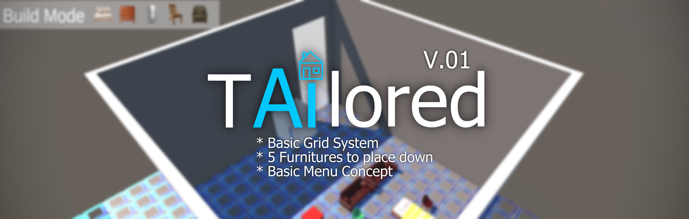

# Tailored

Goals for V.02
* Be able to let the user import a type of model that they can place into the screen during game-time

* Try to get 3 models for each considerable object (chair, desk, table, couch, bed) to help build a solid inventory system 

* Functional Screens (Menu, Profile, Import, Scene)

V.03 (AI Central) 

* Profile System for AI bot 

Later
* Figure out how we are going to implement an AI model to learn from possible nodes and relationships and then also place them into environment
